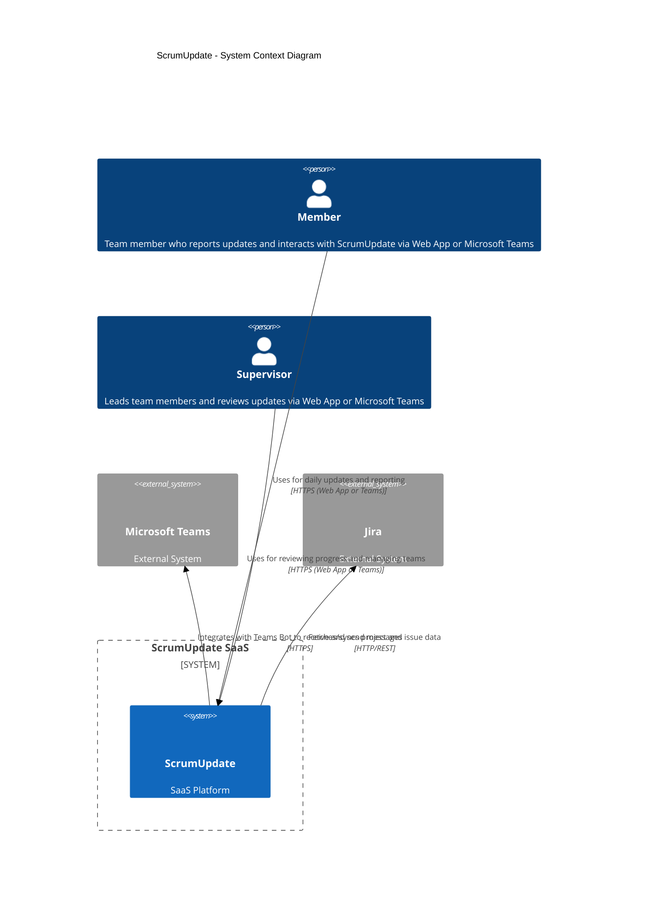

# ScrumUpdate
## C4 System Context Diagram



## C4 Container Diagram

```mermaid
%%{init: {'theme': 'neutral', 'themeVariables': { 'fontSize': '14px', 'primaryColor': '#eaf4fc', 'edgeLabelBackground':'#ffffff'}}}%%
C4Container
title ScrumUpdate - Container Diagram

Person(member, "Member", "Uses ScrumUpdate via Web App or Teams Bot")
Person(supervisor, "Supervisor", "Manages teams and uses ScrumUpdate via Web App or Teams Bot")

System_Ext(ms_teams, "Microsoft Teams", "External System used by Members and Supervisors to interact with ScrumUpdate Teams Bot")

System_Boundary(scrumupdate, "ScrumUpdate SaaS") {

  Container(webapp, "Web App", "Angular", "Front-end application for Members and Supervisors to interact with ScrumUpdate")

  Container(teamsbot, "Teams Bot", "Microsoft Bot Framework", "Bot interface for ScrumUpdate users within Microsoft Teams")

  Container(kbs, "Khoji Business Server (KBS)", "Java / Spring Boot", "Core business logic and gateway for web app")

  Container(kgs, "Khoji Gen AI Server (KGS)", ".NET / ASP.NET Minimal APIs", "Provides AI and natural language features for ScrumUpdate")

  Container(kas, "Khoji Analytics Server (KAS)", "Python / Flask", "Performs analytics and reporting tasks")

  Container(kss, "Khoji Sync Server (KSS)", "Python", "Fetches and syncs Jira data into PostgreSQL")

  Container(kbs_bill, "Khoji Billing Server", "Java / Spring Boot", "Handles billing and invoicing for ScrumUpdate")

  ContainerDb(pgsql, "PostgreSQL", "Database", "Stores application data (separate schemas per service)")
}

Rel(member, webapp, "Uses", "HTTPS")
Rel(supervisor, webapp, "Uses", "HTTPS")

Rel(member, ms_teams, "Uses", "HTTPS")
Rel(supervisor, ms_teams, "Uses", "HTTPS")
Rel(ms_teams, teamsbot, "Sends/Receives messages", "HTTPS")

Rel(webapp, kbs, "Invokes APIs", "HTTP/REST")
Rel(teamsbot, kgs, "Invokes APIs", "HTTP/REST")

Rel(kbs, kgs, "Requests AI processing", "HTTP/REST")
Rel(kbs, kas, "Fetches analytics results", "HTTP/REST")
Rel(kbs, kss, "Triggers data sync", "HTTP/REST")
Rel(kbs, kbs_bill, "Processes billing", "HTTP/REST")

Rel(kbs, pgsql, "Reads/Writes data", "SQL")
Rel(kgs, pgsql, "Reads/Writes data", "SQL")
Rel(kas, pgsql, "Reads/Writes data", "SQL")
Rel(kss, pgsql, "Reads/Writes data", "SQL")
Rel(kbs_bill, pgsql, "Reads/Writes data", "SQL")
