# Jira Sync Platform (KSS) - Architecture Diagram

## System Overview

The Jira Sync Platform is a **distributed, multi-tenant SaaS platform** for synchronizing Jira data with PostgreSQL. It implements a modern microservices-inspired architecture with complete tenant isolation, distributed task processing, and enterprise-grade operational features.

```mermaid
graph TB
    %% External Systems
    subgraph "External Systems"
        JIRA[Jira Cloud/Server<br/>Multiple Tenant Instances]
        CLIENT[Client Applications<br/>Web/Mobile/API]
    end

    %% API Gateway Layer
    subgraph "API Gateway Layer"
        FASTAPI[FastAPI Server<br/>Port 8000<br/>Multi-tenant REST API]
        DOCS[API Documentation<br/>/docs, /redoc]
    end

    %% Authentication & Multi-tenancy
    subgraph "Multi-Tenant Management"
        TENANT_MGR[Multi-Tenant Manager<br/>Tenant Provisioning<br/>Schema Isolation]
        AUTH[Authentication Layer<br/>Jira Credentials<br/>OAuth Support]
    end

    %% Business Logic Layer
    subgraph "Business Logic Layer"
        subgraph "API Controllers"
            HEALTH_API[Health Controller<br/>System Monitoring]
            JOB_API[Job Controller<br/>Job Submission]
            JOB_MGT_API[Job Management Controller<br/>Advanced Analytics]
            TENANT_API[Tenant Controller<br/>Tenant Operations]
            SYNC_API[Sync Controllers<br/>Boards, Sprints, Issues, Worklogs]
        end
        
        subgraph "Services Layer"
            JOB_SVC[Job Management Service<br/>Business Logic]
            JIRA_SVC[Jira Services<br/>Board, Sprint, Issue, Worklog]
            JIRA_CLIENT[Jira Client<br/>API Communication]
        end
    end

    %% Job Processing System
    subgraph "Distributed Job Processing"
        subgraph "Job Factory & Management"
            JOB_FACTORY[Job Factory<br/>Job Creation & Validation]
            JOB_BASE[Base Job Classes<br/>Abstract Job Framework]
        end
        
        subgraph "Celery Task System"
            CELERY_APP[Celery Application<br/>Task Orchestration]
            WORKER1[Celery Worker 1<br/>Job Execution]
            WORKER2[Celery Worker 2<br/>Job Execution]
            WORKER3[Celery Worker N<br/>Job Execution]
            FLOWER[Flower Dashboard<br/>Port 5555<br/>Monitoring]
        end
        
        subgraph "Job Types"
            BOARD_JOB[Board Sync Job<br/>Jira Boards]
            SPRINT_JOB[Sprint Sync Job<br/>Sprint Data]
            ISSUE_JOB[Sprint Issues Job<br/>Issue Details]
            WORKLOG_JOB[Worklog Sync Job<br/>Time Tracking]
            ACTIVITY_JOB[Recent Activity Job<br/>Change Detection]
            BURNDOWN_JOB[Burndown Refresh Job<br/>Analytics]
        end
    end

    %% Data Access Layer
    subgraph "Data Access Layer"
        subgraph "Repository Pattern"
            SYNC_REPO[Sync Job Repository<br/>Job Persistence]
            BOARD_REPO[Board Repository<br/>Board Data]
            SPRINT_REPO[Sprint Repository<br/>Sprint Data]
            ISSUE_REPO[Issue Repository<br/>Issue Data]
            WORKLOG_REPO[Worklog Repository<br/>Time Data]
            BASE_REPO[Base Repository<br/>Common Operations]
        end
        
        DB_MGR[Database Manager<br/>Connection Management<br/>Multi-tenant Routing]
    end

    %% Infrastructure Layer
    subgraph "Infrastructure Layer"
        subgraph "Message Broker"
            REDIS[Redis<br/>Port 6379<br/>Task Queue & Cache]
        end
        
        subgraph "Database System"
            POSTGRES[PostgreSQL<br/>Port 5435<br/>Multi-tenant Data]
            
            subgraph "Database Schemas"
                SYS_SCHEMA[kss_system Schema<br/>System Management<br/>Tenant Registry]
                TENANT1[tenant_acme Schema<br/>Tenant: acme<br/>Isolated Data]
                TENANT2[tenant_beta Schema<br/>Tenant: beta<br/>Isolated Data]
                TENANTN[tenant_* Schemas<br/>Dynamic Tenant Schemas]
            end
        end
        
        subgraph "Containerization"
            DOCKER[Docker Compose<br/>Service Orchestration]
        end
    end

    %% Data Flow Connections
    CLIENT --> FASTAPI
    FASTAPI --> DOCS
    FASTAPI --> HEALTH_API
    FASTAPI --> JOB_API
    FASTAPI --> JOB_MGT_API
    FASTAPI --> TENANT_API
    FASTAPI --> SYNC_API
    
    FASTAPI --> TENANT_MGR
    FASTAPI --> AUTH
    
    JOB_API --> JOB_SVC
    JOB_MGT_API --> JOB_SVC
    SYNC_API --> JIRA_SVC
    
    JOB_SVC --> JOB_FACTORY
    JOB_SVC --> SYNC_REPO
    JIRA_SVC --> JIRA_CLIENT
    
    JOB_FACTORY --> JOB_BASE
    JOB_FACTORY --> BOARD_JOB
    JOB_FACTORY --> SPRINT_JOB
    JOB_FACTORY --> ISSUE_JOB
    JOB_FACTORY --> WORKLOG_JOB
    JOB_FACTORY --> ACTIVITY_JOB
    JOB_FACTORY --> BURNDOWN_JOB
    
    JOB_API --> CELERY_APP
    CELERY_APP --> WORKER1
    CELERY_APP --> WORKER2
    CELERY_APP --> WORKER3
    CELERY_APP --> FLOWER
    
    WORKER1 --> BOARD_JOB
    WORKER2 --> SPRINT_JOB
    WORKER3 --> ISSUE_JOB
    
    SYNC_REPO --> DB_MGR
    BOARD_REPO --> DB_MGR
    SPRINT_REPO --> DB_MGR
    ISSUE_REPO --> DB_MGR
    WORKLOG_REPO --> DB_MGR
    BASE_REPO --> DB_MGR
    
    DB_MGR --> POSTGRES
    TENANT_MGR --> SYS_SCHEMA
    DB_MGR --> TENANT1
    DB_MGR --> TENANT2
    DB_MGR --> TENANTN
    
    CELERY_APP --> REDIS
    WORKER1 --> REDIS
    WORKER2 --> REDIS
    WORKER3 --> REDIS
    
    JIRA_CLIENT --> JIRA
    
    %% Styling
    classDef external fill:#e1f5fe
    classDef api fill:#f3e5f5
    classDef business fill:#e8f5e8
    classDef processing fill:#fff3e0
    classDef data fill:#fce4ec
    classDef infrastructure fill:#f1f8e9
    
    class JIRA,CLIENT external
    class FASTAPI,DOCS api
    class HEALTH_API,JOB_API,JOB_MGT_API,TENANT_API,SYNC_API,JOB_SVC,JIRA_SVC,JIRA_CLIENT business
    class CELERY_APP,WORKER1,WORKER2,WORKER3,FLOWER,JOB_FACTORY,JOB_BASE,BOARD_JOB,SPRINT_JOB,ISSUE_JOB,WORKLOG_JOB,ACTIVITY_JOB,BURNDOWN_JOB processing
    class SYNC_REPO,BOARD_REPO,SPRINT_REPO,ISSUE_REPO,WORKLOG_REPO,BASE_REPO,DB_MGR data
    class REDIS,POSTGRES,SYS_SCHEMA,TENANT1,TENANT2,TENANTN,DOCKER infrastructure
```



## Architecture Layers

### 1. **API Gateway Layer**
- **FastAPI Server**: Modern async web framework serving REST API
- **Multi-tenant Request Handling**: Tenant identification via `X-Tenant-ID` header
- **API Documentation**: Auto-generated OpenAPI/Swagger documentation
- **Request Validation**: Pydantic models for request/response validation

### 2. **Multi-Tenant Management**
- **Dynamic Tenant Provisioning**: Auto-creation of tenant schemas on first access
- **Schema Isolation**: Complete data separation using PostgreSQL schemas
- **Tenant Registry**: System schema tracking all registered tenants
- **Authentication**: Support for Jira API tokens and OAuth credentials

### 3. **Business Logic Layer**

#### API Controllers
- **Health Controller**: System health monitoring and diagnostics
- **Job Controller**: Basic job submission and status tracking
- **Job Management Controller**: Advanced job analytics and management
- **Tenant Controller**: Tenant lifecycle management
- **Sync Controllers**: Specialized endpoints for different sync operations

#### Services Layer
- **Job Management Service**: Core business logic for job operations
- **Jira Services**: Domain-specific services for Jira entities
- **Jira Client**: HTTP client for Jira API communication

### 4. **Distributed Job Processing**

#### Job Factory System
- **Job Factory**: Centralized job creation and validation
- **Base Job Classes**: Abstract framework for consistent job implementation
- **Job Types**: Specialized implementations for different sync operations

#### Celery Task System
- **Celery Application**: Distributed task queue orchestration
- **Multiple Workers**: Horizontal scaling with multiple worker processes
- **Queue Management**: Priority-based task routing and execution
- **Monitoring**: Flower dashboard for real-time task monitoring

#### Supported Job Types
- **Board Sync**: Synchronize Jira boards and projects
- **Sprint Sync**: Synchronize sprint metadata and timelines
- **Sprint Issues**: Synchronize issues within sprints with full details
- **Worklog Sync**: Synchronize time tracking data
- **Recent Activity**: Detect and sync recently changed issues
- **Burndown Refresh**: Update sprint analytics and metrics

### 5. **Data Access Layer**

#### Repository Pattern
- **Base Repository**: Common database operations and patterns
- **Specialized Repositories**: Entity-specific data access logic
- **Database Manager**: Connection management and tenant routing
- **Transaction Management**: ACID compliance and rollback support

### 6. **Infrastructure Layer**

#### Message Broker
- **Redis**: Task queue, result backend, and caching
- **Queue Routing**: Different queues for different job types
- **Result Storage**: Persistent task result storage

#### Database System
- **PostgreSQL**: Primary data store with multi-tenant architecture
- **System Schema**: Global tenant registry and management functions
- **Tenant Schemas**: Isolated data storage per tenant
- **Dynamic Schema Creation**: Automatic provisioning of new tenant schemas

#### Containerization
- **Docker Compose**: Service orchestration and deployment
- **Environment Management**: Configuration through environment variables
- **Scalability**: Easy horizontal scaling of workers and services

## Key Architectural Patterns

### 1. **Multi-Tenancy**
- **Schema-per-Tenant**: Complete data isolation using PostgreSQL schemas
- **Dynamic Provisioning**: Tenants created automatically on first access
- **Tenant Context**: Request-scoped tenant identification and routing

### 2. **Repository Pattern**
- **Data Access Abstraction**: Clean separation between business logic and data access
- **Consistent Interface**: Standardized CRUD operations across all entities
- **Transaction Management**: Proper handling of database transactions

### 3. **Factory Pattern**
- **Job Creation**: Centralized job instantiation and configuration
- **Type Safety**: Compile-time validation of job types and parameters
- **Extensibility**: Easy addition of new job types

### 4. **Command Pattern**
- **Job Execution**: Jobs as executable commands with consistent interface
- **Undo/Retry**: Support for job retry and failure handling
- **Audit Trail**: Complete tracking of job execution history

### 5. **Observer Pattern**
- **Progress Tracking**: Real-time job progress updates
- **Event Handling**: Celery signals for job lifecycle events
- **Monitoring**: Health checks and system metrics

## Data Flow

### 1. **Job Submission Flow**
```
Client Request → FastAPI → Tenant Resolution → Job Validation → Celery Queue → Worker Execution → Result Storage
```

### 2. **Multi-Tenant Data Access**
```
API Request → Tenant ID Extraction → Schema Resolution → Repository → Database Connection → Tenant-Specific Schema
```

### 3. **Jira Synchronization Flow**
```
Job Execution → Jira API Client → Data Transformation → Repository Layer → Database Storage → Result Reporting
```

## Scalability & Performance

### Horizontal Scaling
- **Multiple Workers**: Scale job processing by adding more Celery workers
- **Queue Partitioning**: Different queues for different job types
- **Database Connections**: Connection pooling and management

### Vertical Scaling
- **Resource Optimization**: Efficient memory and CPU usage
- **Batch Processing**: Bulk operations for large datasets
- **Caching**: Redis-based caching for frequently accessed data

### Performance Monitoring
- **Health Checks**: Comprehensive system health monitoring
- **Metrics Collection**: Job execution metrics and performance data
- **Real-time Monitoring**: Flower dashboard for live system status

## Security & Reliability

### Security
- **Tenant Isolation**: Complete data separation between tenants
- **Credential Management**: Secure handling of Jira API credentials
- **Input Validation**: Comprehensive request validation and sanitization

### Reliability
- **Error Handling**: Comprehensive error handling and recovery
- **Retry Logic**: Automatic retry of failed jobs with exponential backoff
- **Transaction Safety**: ACID compliance and rollback support
- **Health Monitoring**: Continuous system health checks

### Operational Features
- **Logging**: Comprehensive logging throughout the system
- **Monitoring**: Real-time system and job monitoring
- **Backup**: Tenant data backup capabilities
- **Maintenance**: Automated cleanup and maintenance operations

## Technology Stack

### Core Technologies
- **Python 3.12**: Primary programming language
- **FastAPI**: Modern async web framework
- **Celery**: Distributed task queue system
- **PostgreSQL**: Primary database with multi-tenant support
- **Redis**: Message broker and caching layer
- **Pydantic**: Data validation and serialization

### Development & Operations
- **Docker**: Containerization and deployment
- **Docker Compose**: Service orchestration
- **Flower**: Celery monitoring dashboard
- **OpenAPI/Swagger**: API documentation
- **Git**: Version control and collaboration

This architecture provides a robust, scalable, and maintainable platform for synchronizing Jira data across multiple tenants with complete isolation and enterprise-grade operational capabilities.